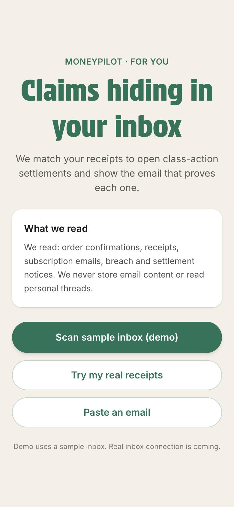
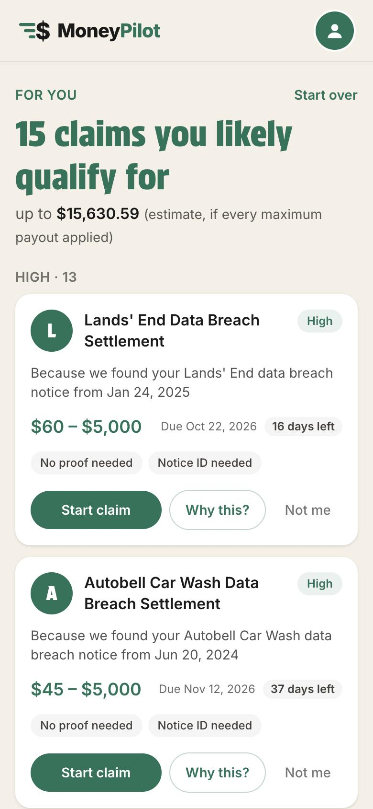
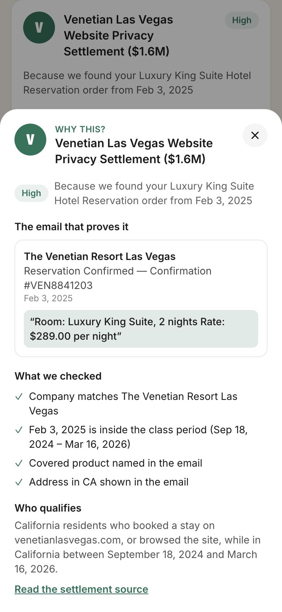

# Inbox Claim Matcher (MoneyPilot MVP)

Reads an inbox, finds proof of what a person bought or used, matches it to open class-action settlements,
and shows a ranked feed of claims with the email that proves each one.

**Live demo:** https://moneypilot-one.vercel.app/

## Problem

Most people who qualify for a class-action settlement never file. They don't know the settlement exists, and
a generic quiz ("Did you buy an air purifier between 2019 and 2023?") asks them to remember purchases from
years ago. The proof is already sitting in their inbox: order confirmations, renewals, breach notices and
settlement notices they skimmed and forgot.

MoneyPilot's app has a "For You" tab next to "All". This feature is what fills it: instead of asking, it
reads the receipts and tells the user which claims are theirs, and why.

## Magic moment

Tap **Connect Gmail**, enter an address and, in about 20 seconds on the live demo (about 11 on a laptop), see a ranked feed where every card names the
email that proves it: "Because we found your iPhone 16 Pro 256GB, AppleCare+ order from Sep 20, 2024".

| Intro | Feed | Why this? |
|---|---|---|
|  |  |  |

## User flow

1. **Intro and consent.** States what is read (order confirmations, receipts, subscription emails, breach
   and settlement notices) and what is not (personal threads; nothing is stored). One button, "Connect Gmail".
2. **Connect Gmail (demo).** Asks for a Gmail address, lists what will be read, then plays a short
   "connecting" sequence. Nothing is connected: no password is asked, the address is never sent to the
   server, and whatever is entered the scan reads the sample inbox. "Skip" runs the same scan without an address. The note on the screen says so.
3. **Scanning.** Counts up the real stats from the API: emails read → purchases and notices → claims matched.
4. **Feed.** A green summary card (claims found, estimated total, emails read, purchases and notices
   found), a search bar and a filter button, then the "For You" list. Claims are grouped into High, Likely
   and Possible, highest confidence first inside each group. The filter has two options: payout range
   (under $25, $25 – $100, $100 – $1,000, over $1,000, by the claim's largest payout) and deadline (within
   14, 30 or 60 days). Search matches the settlement name, company and product. Each card shows the settlement,
   a band pill (High / Likely / Possible; the numeric score stays behind the scenes for ranking), the reason line,
   the payout range, the deadline with days left (red when 14 days or fewer), and "Proof needed" / "Notice ID needed" tags.
5. **Why this?** A bottom sheet on phones and a centred pop-up on web, with the primary email (sender, subject, date, quoted evidence line),
   supporting emails, the checks that passed or need attention (company, class period, product, state),
   who qualifies, and a link to the settlement source.
6. **Act.** "Start claim" opens an in-app claim screen with the payout, deadline, why it matched, who
   qualifies and what is needed. "Claim Settlement" leads to a draw-to-sign step and a "Claim Submitted!"
   screen. This is a demo of the filing flow: nothing is sent and the signature is not stored; the official
   claim site is linked from these screens.
   "Not me" hides the card with an undo. Possible
   cards ask one Yes/No question built from the eligibility summary; Yes moves the card to Likely.

## Algorithm

```
prefilter → Claude extraction → match → E×M×T×P score → Claude judge (Likely / Possible) → re-score → bands → sort
```

1. **Prefilter** (`lib/prefilter.ts`, rules only). Keep an email if the sender name or domain matches a
   settlement company or alias, or the subject/body contains a transaction or notice keyword (receipt,
   order, renewal, refund, data breach, settlement, account, ...). On the sample inbox this keeps 38 of 45.
2. **Extract** (`lib/extract.ts`, Claude Haiku 4.5). Batches of 10 in parallel. Per email: `company` (the
   merchant), `brand`, `product`, `email_type`, `transaction_date`, a quoted `evidence_line`,
   `billing_state`, and `is_false_positive` with a reason. The JSON is validated with zod, with one retry.
3. **Match** (`lib/match.ts`, deterministic). Names are normalised (lowercase, strip inc/llc/ltd/.com and
   punctuation) and compared with each settlement's company, aliases and parent company. Purchases from
   retailers (Amazon, Best Buy, Walmart) match on the brand in the product line, which is how a Levoit
   purifier bought on Amazon finds the Levoit settlement.
4. **Score** (`lib/score.ts`, deterministic). `confidence = E × M × T × P × state`, plus 0.05 per supporting
   email (max +0.15), capped at 0.99.

   | Factor | Values |
   |---|---|
   | **E** email type | settlement notice 1.0, breach notice 0.95, receipt / order / renewal / billing 0.9, account notice 0.7, marketing / other 0.3 |
   | **M** name match | exact or alias 1.0, parent company 0.8, partial name overlap 0.5 |
   | **T** timing | inside the class period 1.0, no period on file 0.7, outside 0.2. A settlement notice, or a breach notice for a breach settlement, is 1.0 |
   | **P** product | covered product named 1.0, settlement has no product list 0.9, product list exists but none found 0.6 |
   | **State** | settlement is state-restricted: same state 1.0, state unknown 0.7, different state → dropped |

5. **Judge** (`lib/judge.ts`, Claude Haiku 4.5). Only claims that land in Likely or Possible get a second
   look. Claude receives the extracted email facts (not the body) and the settlement's eligibility text and
   returns `product_fit` (0–1), `own_transaction` (true/false) and a short reason. `product_fit` replaces
   **P** and the formula scores the claim again; `own_transaction = false` drops the email like any other
   false positive. High claims are never judged, and if the judge call fails the formula score stands.
6. **Bands.** High ≥ 0.75, Likely ≥ 0.50, Possible ≥ 0.30, anything lower is hidden and counted in the
   footer. Claims are grouped by settlement; the strongest email is the primary evidence.
7. **Sort.** By band, then by confidence × payout midpoint.

Claude reads and labels emails, and gives one input (product fit) on borderline claims. Which settlement an
email supports, and the final score and band, always come from rules a reviewer can read.

If the API key is missing, Claude errors, or the scan takes longer than 20 seconds, the sample scan returns
a saved good run (`data/results.cached.json`) and the footer tag reads "cached" instead of "live".

## Real vs mocked

| Part | Status |
|---|---|
| Settlement catalogue (`data/settlements.json`) | **Real.** 17 open settlements read from openclassactions.com and topclassactions.com on Oct 6, 2026. Spreadsheet copy: `data/settlements-tracker.csv` |
| Extraction, matching, scoring, bands | **Real.** Runs live on every scan |
| Real receipts (`data/real-samples.json`) | **Real.** Four of the builder's own emails, redacted. Used by the eval and the scan API (`source: "real"`); no button in the UI |
| Single pasted email | **Real.** The scan API accepts one email (`source: "paste"`); no form in the UI |
| UI and deploy | **Real** |
| Sample inbox (`data/inbox.json`) | **Mocked.** 45 synthetic emails for a fictional persona, each with a ground-truth label. Spreadsheet copy with results: `data/email-tracker.csv` |
| Inbox connection (Gmail / Outlook OAuth) | **Not built** |
| Claim filing | **Mocked.** The details → sign → submitted screens are a demo; nothing is sent, and the official claim site is linked |

## False-positive handling

A wrong claim costs more than a missed one: it wastes the user's time and, if filed, is a false statement.
There are three layers.

**1. Claude flags emails that are not evidence** (`is_false_positive`), and they are dropped before scoring:

- the person writing *about* a settlement to a friend, rather than receiving a notice
- news or newsletters reporting on a lawsuit
- scams: promised money, urgent links, requests for bank or SSN, sender domain that doesn't match the company
- marketing with no sign of a purchase or account
- a company that is not the party the person transacted with

**2. Merchant, not processor.** PayPal, Stripe, Apple Pay, Klarna and Afterpay are never the company. A
PayPal email saying "You authorized $59.95 USD to Fabletics" is extracted as Fabletics.

**3. Deterministic guards in matching and scoring**, which hold even if Claude gets an email wrong:

- **Same name, different company.** Equinox, Inc. (a nonprofit health provider in Albany, NY) has a data
  breach settlement. Equinox the gym does not. Normalising both names gives "equinox", so the settlement
  carries `excluded_sender_domains: ["equinox.com"]` and a gym membership receipt can never match it. The
  real breach notice, from a different domain, scores High.
- **Similar names.** "Venetian Blinds Direct" only partially overlaps "The Venetian Resort", scores far
  below the Possible threshold, and is never shown.
- **Right company, wrong product or date.** An iCloud+ receipt does not support the iPhone settlement; a
  Bestway pool bought in 2025 falls outside the 2008–2024 window and is hidden.
- **Supporting emails must stand alone.** An email only adds to a claim if it would score at least Possible
  by itself and names a covered product when the settlement has a product list.

In the labelled sample inbox, seven trap emails cover these cases; none is used as evidence (see Eval).

## Privacy

**In this MVP**

- No inbox is connected. The UI scans the synthetic sample inbox only; the real receipts used in the eval
  are the builder's own and redacted.
- Email text is sent to Anthropic's API for extraction and to nothing else. Bodies are cut to 2,500
  characters first.
- Nothing is written to a database or to disk: there is no database, no account and no cookie. Server logs
  record only an error message when a scan fails, never email content.
- The prefilter runs before the model, so emails that are plainly noise never leave the server.
- "Not me" is logged to the browser console only.

**For production**

- Gmail and Outlook OAuth with read-only scope, and a server-side search query restricted to receipt and
  notice senders and keywords, so personal threads are never fetched.
- Keep only derived facts (company, product, date, the short evidence line and a message ID to link back),
  never the email body. Let users delete these and disconnect at any time.
- A zero-retention agreement with the model provider, encryption at rest for tokens and derived facts, and
  a security review of the OAuth scopes before launch.
- Plain-language consent before the first scan, listing what is read and what is kept.

## Eval

`scripts/eval.ts` runs the full pipeline on each data set and compares the claims with the ground-truth
`label` on every email. Labels are never sent to Claude or the UI.

```bash
npx tsx --env-file=.env.local scripts/eval.ts
```

A claim is **correct** when its settlement is in some email's `expected_settlement_ids` and its band is in
that email's `acceptable_bands`. **Recall** is expected settlements found / expected settlements. A **trap**
is an email labelled `is_trap` (news, scam, marketing, a friend's email, a same-name company) that must never
be used as evidence.

Results from the run on Oct 6, 2026 (model `claude-haiku-4-5-20251001`, saved in `data/eval.json`):

| | Synthetic inbox (45 emails) | Real receipts (4 emails) |
|---|---|---|
| Claims shown | 15 | 1 |
| High: shown / correct / precision | 13 / 13 / 100% | 1 / 1 / 100% |
| Likely: shown / correct / precision | 1 / 1 / 100% | 0 / 0 / n/a |
| Possible: shown / correct / precision | 1 / 1 / 100% | 0 / 0 / n/a |
| Recall | 15 / 15 (100%) | 1 / 1 (100%) |
| Traps used as evidence | 0 | 0 |
| Missed settlements | none | none |

Targets: high precision ≥ 90%, recall ≥ 80%, traps = 0. All met.

**Effect of the judge step** (same day, `--no-judge` vs default). Precision, recall and traps are unchanged.
The judge reviewed the two Likely claims: Equifax stayed Likely (product fit 1.0, 0.70), and MDLive moved
from Likely (0.63) to Possible (0.35) because the email shows a visit but not the portal sign-in the class
requires. Its label accepts either band. At 0.35 it sits close to the 0.30 cut-off, so a stricter verdict on
a rerun could hide it; that is the main risk the judge adds.

**Per-email tracker.** `data/email-tracker.csv` lists all 49 sample emails with their label, what Claude
extracted, and whether each was used as primary proof, supporting proof or not at all. Regenerate it with
`npx tsx --env-file=.env.local scripts/email-tracker.ts`.

**Settlement tracker.** `data/settlements-tracker.csv` is the 17-settlement catalogue as a spreadsheet
(company, class period, payout, deadline, proof rules, claim and source links) with how each one did in the
saved sample scan. Regenerate it with `npx tsx scripts/settlements-tracker.ts`; it needs no API key.

How to read these numbers:

- The synthetic inbox was written against the settlement list, and the matching rules and extraction prompt
  were tuned while looking at it. This is a regression check, not a held-out test.
- The real set is four emails with one expected claim, so its percentages carry little weight. Its value is
  the three real receipts (Fabletics via PayPal, Lyft, WHOOP) that correctly return no claim.
- Extraction uses a language model, so a rerun can move a borderline email between bands. One run is
  reported here.

## How I'd verify and monitor after launch

None of this is built yet; it is the plan.

**Before widening access**

- Build a held-out labelled set from consenting users' real inboxes (several hundred emails) that nobody
  tunes against, and run `scripts/eval.ts` on it in CI. Block a release if High precision drops below 90%
  or any trap email is used as evidence.
- Have a person review every High claim for the first cohort of users.

**In production**

- **"Not me" rate per settlement and per band.** This is the live false-positive signal; the event is
  already emitted with `settlement_id` and `confidence`. A settlement with a high rate usually means a bad
  alias or a name collision.
- **Calibration.** Of claims shown as High, how many are started, and how many are later paid or rejected.
- **Possible → Yes rate**, to tune the 0.30 and 0.50 thresholds.
- **Live vs cached share, scan latency (p50 / p95), extraction retry and failure rate, cost per scan.**
- **Settlement freshness.** Alert when a deadline has passed or a source page has changed.
- A weekly sample of dropped and hidden emails, read by a person, to catch missed claims that no user
  would ever report.

## Known limitations

- **Evidence is not eligibility.** The inbox shows a purchase or an account, not every class condition.
  It cannot show that a Flo user logged cycle data, that an MDLive user had a Facebook account, or that a
  pool is 48 inches tall. The drawer shows the full eligibility text so the user makes the final call.
- **The "up to $X" total is an upper bound.** It sums each settlement's maximum payout, and three breach
  settlements have a $5,000 maximum that applies only to documented losses.
- **The settlement list is a snapshot** from Oct 6, 2026. Deadlines and terms will go stale.
- **Name matching is simple.** Aliases are hand-written, the retailer list is hard-coded, and a new
  same-name collision needs a manual exclusion like the Equinox one.
- **State comes only from an address in the email.** With no address, a state-restricted claim is
  down-weighted, not confirmed.
- **Model variability.** The same email can occasionally be typed differently between runs, which can move
  a claim across a band boundary.
- **The eval set is small and was used for tuning** (see Eval).
- **The scan endpoint is public** with no rate limit or auth, which is acceptable for a demo only.
- **English-language, US emails only.** Receipts as PDF attachments or images are not read.

## Future scope

- **Gmail and Outlook OAuth**, read-only, with a server-side query limited to receipts and notices.
- **Live settlement sync** from the source sites, with a review step before a new settlement goes live.
- **PDF and image receipts**, since many orders and invoices arrive as attachments.
- **Lawsuit watchlist.** Track pending cases for companies found in the inbox and notify the user when one
  settles. The real sample set already has two candidates noted in its labels: Fabletics and WHOOP.
- **Payout detection.** Spot settlement payment emails to confirm a claim was paid and close the loop on
  calibration.
- **Judge on High claims too**, reading the full email next to the eligibility text, once there is a
  held-out set large enough to show it helps.
- **Assisted filing**: pre-fill the claim form with the Notice ID and details found in the email.

## Run it locally

```bash
npm install
```

Put `ANTHROPIC_API_KEY=...` in `.env.local` (see `.env.example`), then:

```bash
npm run dev
```

```bash
npx tsx --env-file=.env.local scripts/run-sample.ts data/inbox.json
```

Stack: Next.js (App Router, TypeScript), Tailwind CSS, the Anthropic SDK and zod. No database, no auth.
